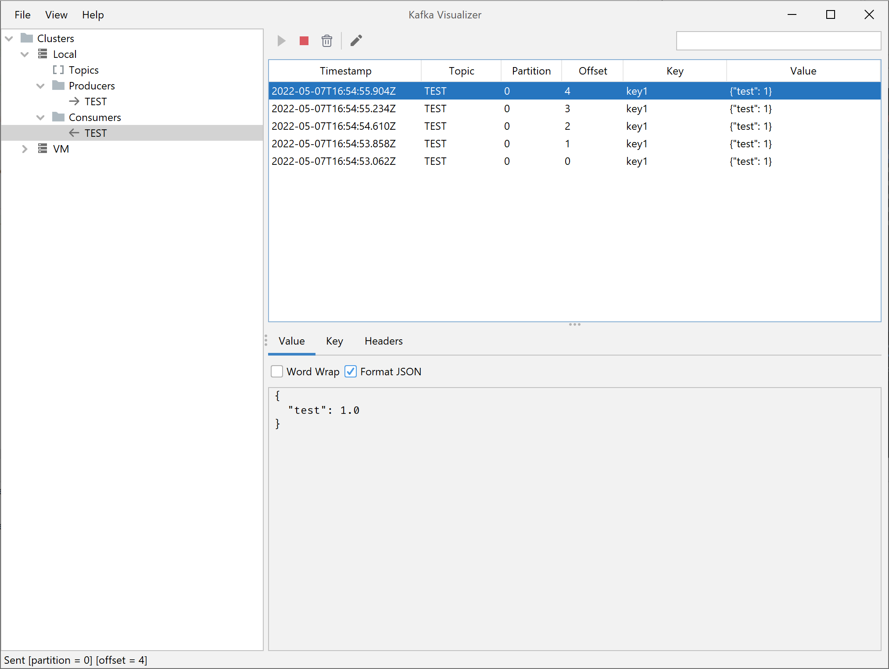
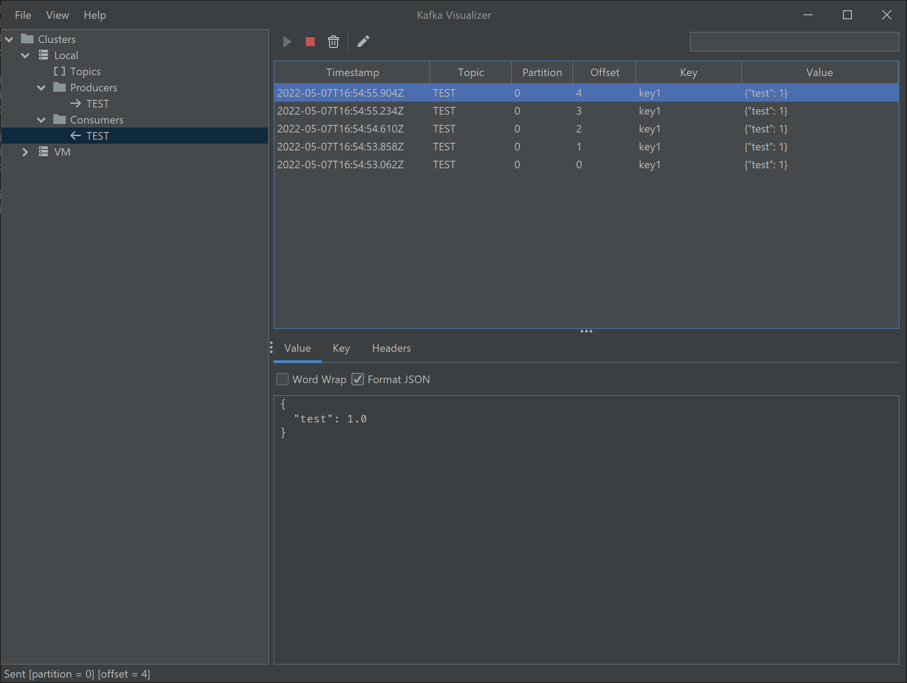

# Kafka Visualizer

Kafka Visualizer is a Kafka GUI client.

It is mainly used to monitor and produce messages in Kafka Clusters for debugging purposes. 





## Download

Kafka Visualizer is distributed as an executable JAR file, you can download it from [here](https://github.com/kumait/kafkavisualizer/releases/download/untagged-6013278681c8aa9e10ad/kafkavisualizer-1.0.jar), to run it 
you need Java 11 or newer.

```bash
java -jar kafkavisualizer-1.0.jar
```